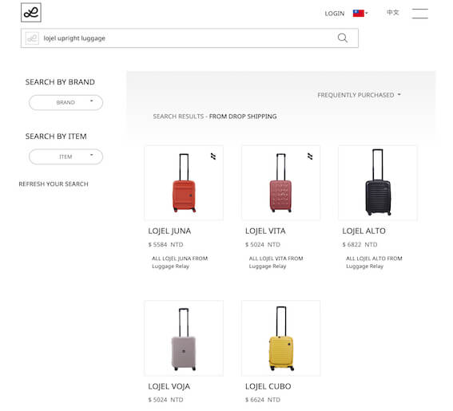
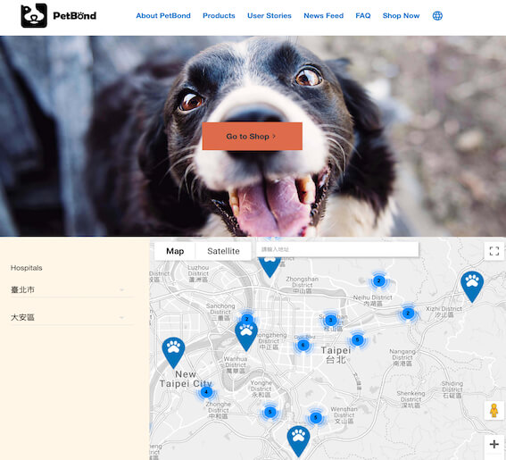

<!-- Main -->

<!-- One -->
<section id="one">
	

		<header class="major">
			<h2>Testimonials</h2>
		</header>
		  
"This was like a one-stop shop for our website."
 
	

</section>

<!-- Two -->
<section id="two" class="spotlights">
	<section>
		
		

			

				<header class="major">
					<h3>Luggage Relay</h3>
				</header>
          
A massive custom-built marketplace built with speedy technology. If your a mom and pop luggage store that wants to sell your products online, simply sign up and start posting your items. If you have used luggage you'd like to sell or rent out, sign up and start posting your items. This web application is capable of multiple locations, languages, and currencies.
          

          
The client wanted a minimalistic design, so that the items could really pop. We designed and developed a verbose easy-to-use business backend, as well as an admin backend. Depending on the type of business or admin level these backends have different capabilities.

				<ul class="actions">
					<li><a href="https://luggagerelay.com/en?location=tw" target= "blank" class="button">Take A Look</a></li>
				</ul>
			

		

	</section>
	<section>
		
		

			

				<header class="major">
					<h3>Canopy</h3>
				</header>
				
A verbose well-designed ecommerce shop for juice delivery. Due to regulations on paypal in Taiwan we had to find and use a local payment gateway. Once we got that figured out we were good to go. And the Canopy girls were stoked about their website. 

				<ul class="actions">
					<li><a href="generic.html" target='blank' class="button">Take A Look</a></li>
				</ul>
			

		

	</section>
	<section>
		
		

			

				<header class="major">
					<h3>Petbond</h3>
				</header>
				
This is a custom-made blog with a few special features. We designed and developed this website to appear as cute as the kittens and puppies that would take advantage of their products. There are the blog-style user stories and articles, in which they are able to create, edit, delete, display and search for their customer's reviews of their products or the same goes for the more informational articles. Also we were able to take their over 100 locations in Taiwan and use google maps to create custom icons that represent their stores. They can also create, edit, delete these as well using their custom cms.

				<ul class="actions">
					<li><a href="https://www.petbond.com.tw/" target="blank" class="button">Take A Look</a></li>
				</ul>
			

		

	</section>
</section>

<!-- Three -->
<section id="three">
	

		<header class="major">
			<h2>Let's chat about how we can help you</h2>
		</header>
    
 Our consultations will give you loads of value and actionable advice, also we'll be able to decide whether or not we're a good fit to work together.

		
Book a call or send us a message below. 

    

      <ul class="actions">
        <li><button onclick="openCalendly()" class="button next"> Book A Call </button></li>
      </ul>
    

	

</section>

